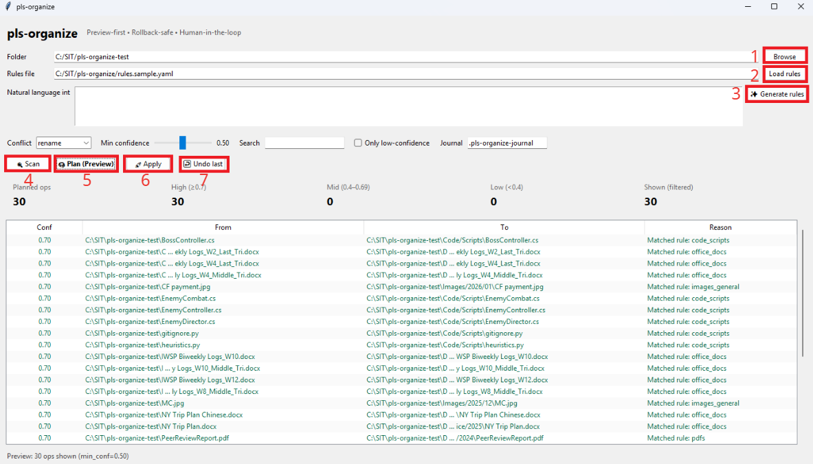

# pls-organize

pls-organize is a preview-first, rollback-safe file organizer with AI-generated rules.

It helps you clean up messy folders using deterministic planning, human approval,
and optional natural-language instructions — without ever blindly touching your files.

## Design Principles
- Preview-first: nothing happens without your approval
- Deterministic execution: plans are generated and validated before execution
- Human-in-the-loop AI: LLMs suggest rules, the engine decides moves
- Transactional safety: every operation can be undone (journal)
- Separation of concerns: scan → plan → apply → rollback

## Quick Start
```bash
pip install -r requirements.txt

python -m cli.main scan "/path/to/folder" -o scan.json
python -m cli.main plan "/path/to/folder" --rules rules.sample.yaml -o plan.json
python -m cli.main apply plan.json --journal .pls-organize-journal
python -m cli.main undo --journal .pls-organize-journal
```
## App GUI
```bash
python -m gui.app
```

## App UI Walkthrough

Below is the main GUI. The numbered boxes match the explanation list right after it.



### Key controls (numbers match the screenshot)

1. **Browse**  
   Pick the target folder you want to organize. This only updates the path field — no files are changed.

2. **Load rules**  
   Load an existing YAML rules file (e.g., `rules.yaml`). The rules define how files will be categorized and moved.

3. **Generate rules**  
   Use your natural-language intent (the text box on the left) to let the AI draft a rules file.  
   **No files are moved** at this stage — it only generates/updates rules for your review.

4. **Scan**  
   Analyze the selected folder and collect metadata (names, extensions, timestamps, sizes, etc.).  
   This step is **read-only** and does not modify any files.

5. **Plan (Preview)**  
   Generate a deterministic move plan based on the loaded/generated rules.  
   The table preview shows exactly what will happen before execution:
   - **From**: current file path
   - **To**: proposed destination
   - **Conf**: confidence score for the rule match
   - **Reason**: which rule triggered the move

6. **Apply**  
   Execute the currently previewed plan (only what you can see/filter in the table).  
   Every operation is recorded to a **journal** so you can safely rollback.

7. **Undo last**  
   Revert the most recent Apply:
   - Moves files back to original locations
   - Removes empty folders created during Apply (when safe)
   This ensures changes are **rollback-safe**.

---

### Typical workflow (safe by design)
1) Select folder + load/generate rules → 2) **Scan** → 3) **Plan (Preview)** → 4) Review/filter → 5) **Apply** → 6) **Undo last** if needed

